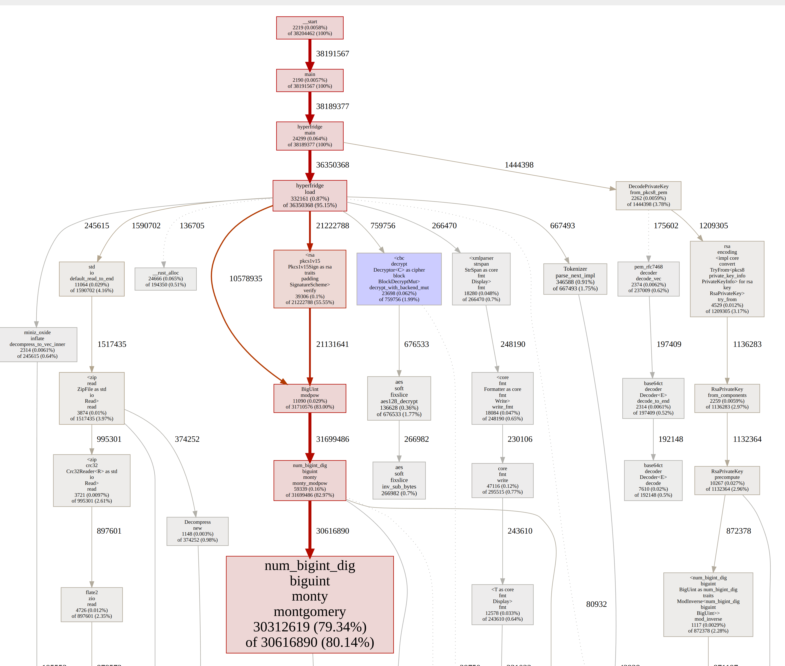

 # Runtime measurements

Conclusions:
- 
- It takes hours to produce the STARK on strong laptop hardware, but it can be considered fast-enough, because the banking backend updates its data only once a working day. Cost is around 6 USD per proof (Cost basis AWS EC2 instance c5d.12xlarge).
- 


- With faster hardware and more CPUs (no CUDA) execution time is around 60 minutes at best.
- RSA...
- Integrate BigNumber XXXX


### On Gaming Laptop

Hardware: Lenovo Legion 5 Pro, 32 GB RAM, Geforce 4070 (cudo NOT activitaed)

vendor_id	: GenuineIntel
cpu family	: 6
model		: 183
model name	: 13th Gen Intel(R) Core(TM) i7-13700HX
cpu MHz		: 1984.575
cache size	: 30720 KB
cpu cores	: 16


```
RUST_LOG="executor=info" RUST_BACKTRACE=1 RISC0_DEV_MODE=true cargo test   -- --nocapture

[2024-01-16T14:29:18Z INFO  executor] total_cycles = 507098
[2024-01-16T14:29:18Z INFO  executor] session_cycles = 39265237
[2024-01-16T14:29:18Z INFO  executor] segment_count = 37
[2024-01-16T14:29:18Z INFO  executor] execution_time = 3.117812573s
```

Runtime for genation of Proof: 12055.32s - around ***200 minutes***.

Risc0 reports 37 segments which are parallized using [continuation](https://www.risczero.com/news/continuations) on 16 cores (24 virtual cores - see hardware spec above). Using hardware with 48 cores execution time would likely be cut half to ***100 minutes*** if CPUs have same speed.


Cycle most expensive calculations:

- **Cycle count verify_bank_signature 10687k**: Checking RSA signature of Bank.
- **Cycle count decrypt_transaction_key 10660k**: Encrypt provided session key, compare result with encrypted session in the EbicsResponse. Plain decryption of the session key with RSA key of Client would add around 80000k cycles, therefore we decrypt outside of guest do the cheaper reverse function to check integritiy.
- **Cycle count decrypt_order_data 24061k**: decrypting payload with symetric key and RSA check for witness signature.


Generating real proof: 
```
FRIDGE_VERBOSE=1 RUST_LOG="executor=info" cargo test   -- --nocapture

```


 ## Local execution


### With Bonsai activated


### Compare with other execution times

     Running `/home/w/workspace/risc0/target/release/examples/loop`


|   Cycles   |   Duration  |    RAM    |    Seal   |   Speed   |
|------------|------------|-----------|-----------|-----------|
|     64k    |    1:21.7   |  472.4MB  |  215.3kB  |  802.6hz  |
|    128k    |    3:06.2   |  944.8MB  |  238.3kB  |  704.1hz  |
|    256k    |    5:11.6   |   1.89GB  |    250kB  |  841.3hz  |
|    512k    |     10:27   |   3.78GB  |  262.2kB  |  836.2hz  |
|   1024k    |   20:12.6   |   7.56GB  |  275.5kB  |  864.8hz  |
|   2048k    |     40:31   |   7.56GB  |    551kB  |  862.7hz  |
|   4096k    |   1:18:33   |   7.56GB  |    1.1MB  |  889.9hz  |


## Profiling data
Install pprof profiling tool and run: 

```bash
RUST_LOG="executor=info" RUST_BACKTRACE=1 RISC0_DEV_MODE=true cargo test profid  -- --nocapture
pprof -http=127.0.0.1:8089 ./host/target/riscv-guest/riscv32im-risc0-zkvm-elf/release/hyperfridge host/profile-output
```
This generates a cycle overview ([full image](./hyperfridge-cycles.html)).


## Benchmarking

https://dev.risczero.com/api/zkvm/benchmarks
